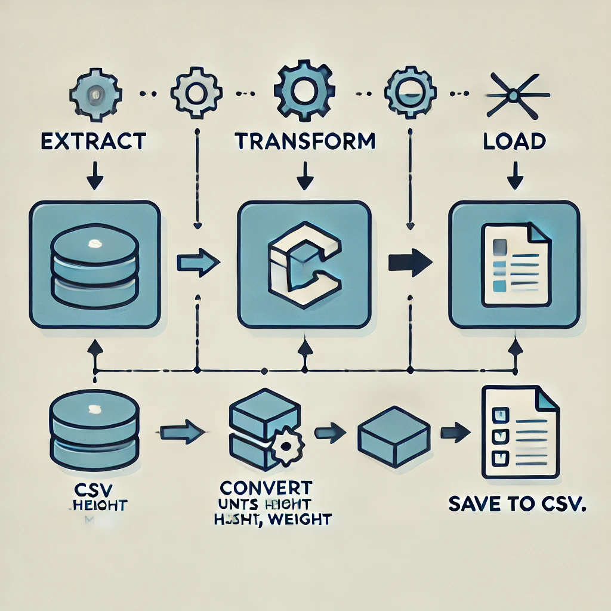

# A Comprehensive ETL Workflow with Python for Data Engineers


## Introduction:
The Extract, Transform, Load (ETL) process is essential for data engineers, enabling them to manage data from various formats and transform it for further use. In this project, we will demonstrate how to extract data from CSV, JSON, and XML formats, transform it, and load the transformed data into a structured format for further processing.


## Objectives:
By the end of this project, you will be able to:
- Extract data from CSV, JSON, and XML files.
- Transform the extracted data into a desired format, including unit conversions.
- Load the transformed data into a CSV file for future use in databases.
- Log the progress of ETL operations for monitoring purposes.



## Technologies Used:
- **Programming Language:** Python
- **Data Formats:** CSV, JSON, XML


## Dataset:
Download the dataset using the following command:
```bash
wget https://cf-courses-data.s3.us.cloud-object-storage.appdomain.cloud/IBMDeveloperSkillsNetwork-PY0221EN-SkillsNetwork/labs/module%206/Lab%20-%20Extract%20Transform%20Load/data/source.zip
```
Unzip the downloaded file:
```bash
unzip source.zip -d ./data
```
After this step, the project folder will contain CSV, JSON, and XML files to work with.


## Steps:

### Step 1: Gather Data Files
- Download and unzip the dataset containing multiple file formats.
- Ensure the project folder includes CSV, JSON, and XML files.

### Step 2: Import Libraries and Set Paths
- Required libraries:
  - `glob` to handle file formats.
  - `pandas` to read CSV and JSON files.
  - `xml.etree.ElementTree` to parse XML data.
  - `datetime` for logging timestamps.
- Set up paths for:
  - `etl_process.log` to record the logs.
  - `transformed_data.csv` to save the final output.

### Step 3: Define Functions for ETL Steps
1. **Extract Data:**
   - Define three functions to extract data from CSV, JSON, and XML files respectively.
   - A master function will combine the extracted data into a single DataFrame.

2. **Transform Data:**
   - Convert heights from inches to meters.
   - Convert weights from pounds to kilograms.

3. **Load Data:**
   - Save the transformed data to a CSV file for further use.

4. **Logging:**
   - Log each phase (Extraction, Transformation, Loading) with a timestamp to ensure traceability and monitoring.

### Step 4: ETL Execution
- The ETL process follows this sequence:
  1. **Extraction Phase:** Extract data from all CSV, JSON, and XML files and combine into one DataFrame.
  2. **Transformation Phase:** Transform measurements to standard units (height to meters, weight to kilograms).
  3. **Loading Phase:** Save the transformed data into a structured CSV file.
  4. **Logging:** Record the start and end of each phase for monitoring.


## Project Files:
- **`extract_csv.py`**: Handles extraction of data from CSV files.
- **`extract_json.py`**: Handles extraction of data from JSON files.
- **`extract_xml.py`**: Handles extraction of data from XML files.
- **`transform.py`**: Contains logic for data transformation (unit conversions).
- **`load.py`**: Manages saving of transformed data to a CSV file.
- **`main.py`**: Orchestrates the ETL process, logs progress, and calls the respective functions.


## How to Run:
1. Clone the repository:
```bash
git clone <repository_link>
```
2. Navigate to the project directory:
```bash
cd etl_project
```
3. Install required libraries:
```bash
pip install pandas
```
4. Execute the main script:
```bash
python main.py
```


## Logging:
- Logs are stored in `./logs/etl_process.log`.
- Each script run will append a new section in the log file for traceability.


## Output:
- Transformed data will be saved to `./output/transformed_data.csv`.


